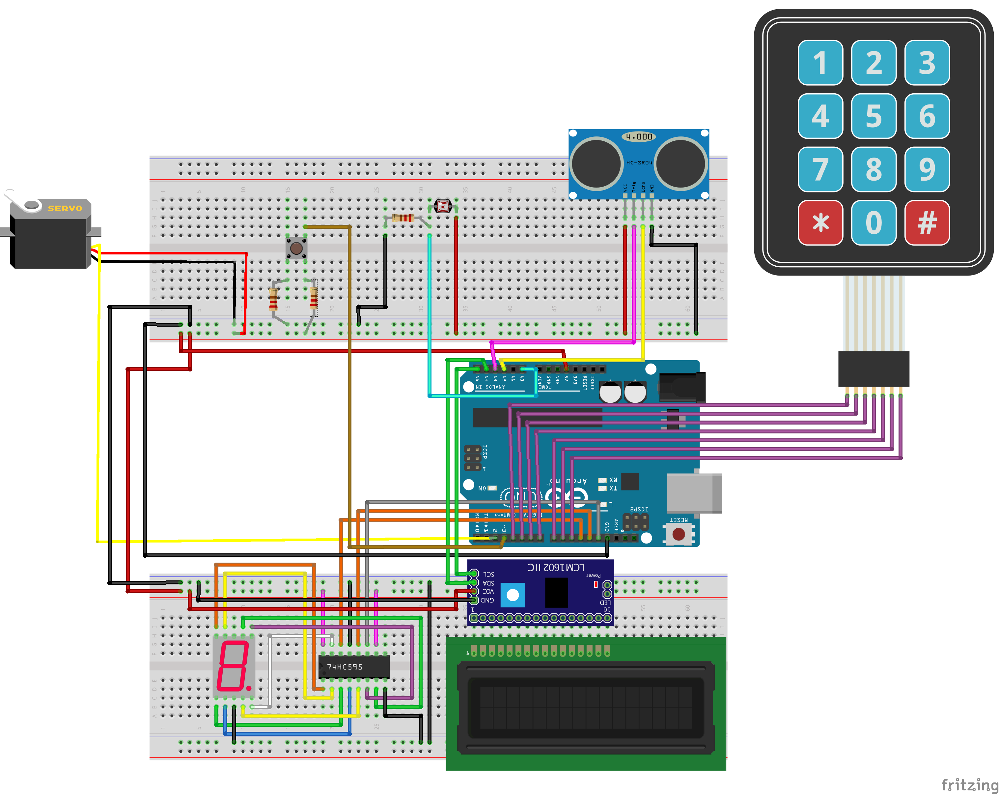

# Lock My Door
Password based security system to secure door

Developed by
- Stevanno Hero Leadervand (NIM 13515082)
- Gilang Ardyamandala (NIM 13515096)
- Rizki Ihza Parama (NIM 13515104)

# Board Diagram Sistem

# Deskripsi Umum
Lock My Door adalah sistem keamanan yang menggunakan Arduino untuk melakukan penguncian. Proses penguncian menggunakan servo yang akan berputar jika berpindah state antara locked atau open.

Kunci dibuka dengan memasukkan password sepanjang 4 (empat) karakter yang dimasukkan melalui keypad. Terdapat lampu yang otomatis menyala saat kondisi sekitar keypad gelap sehingga pengguna dapat dengan mudah memasukkan password walaupun dalam keadaan gelap. Kecerahan lampu diatur menggunakan sensor cahaya dan teknik Pulse Width Modulation (PWM) untuk outputnya. Selain sensor cahaya, sensor yang digunakan yaitu sensor jarak atau ultrasonic yang digunakan untuk mengetahui posisi user terhadap sistem. Jika user sedang dalam jangkauan alat pada jarak tertentu, maka sistem bisa berfungsi.

Basis data pada server digunanakan untuk menyimpan log activity user. LCD digunakan untuk menampilkan status lock atau open dan pesan lainnya seperti greeting message dan proses penginputan password. IC digunakan untuk konektor pada 7 segments display dan juga pada LCD.
Sistem tidak terintegrasi dengan sistem lain baik Android maupun Unity.

# Panduan Instalasi dan Pemakaian
1. User harus berada pada jarak tertentu untuk menyalakan sistem atau menekan button yang telah disediakan
2. User menunggu proses STARTING selesai
3. User memasukkan password default saat pertama kali menggunakan sistem yaitu 1234
4. User bisa mengganti password setelah sistem unlocked dengan menekan key # lalu memasukkan password menggunakan keypad
5. User bisa mengunci kembali sistem dengan menekan button yang telah disediakan

## Bandung Institute of Technology, 2018.
IF3111 - GERCEP